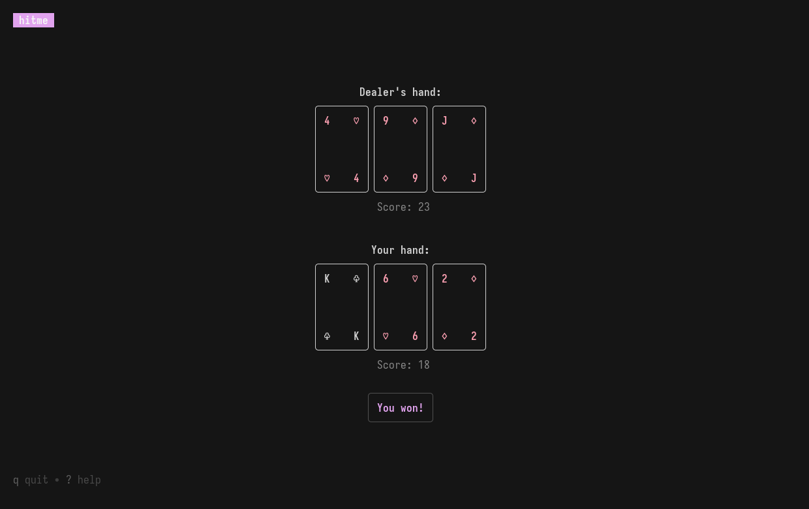

<div align="center">

# ./hitme



_Wonderful piece of software._

</div>

**hitme** is a _relatively_ small and simple blackjack game that runs in your terminal.

Written in Go. TUI powered by [Bubble Tea](https://github.com/charmbracelet/bubbletea).

---

## Installation

### Via Go _(Recommended)_

```sh
go install github.com/errium/hitme@latest
```

> [!NOTE]
> The binary is installed into `$(go env GOPATH)/bin` (usually `~/go/bin`).
> You can run the game directly from that path, or add it to your `PATH` variable.
> You can do the latter like this:

```sh
export PATH=$PATH:$(go env GOPATH)/bin
```

### Build from source

```sh
git clone https://github.com/errium/hitme.git
cd hitme
go build -o hitme
```

## License

This project is licensed under GPL-3.0-or-later.
